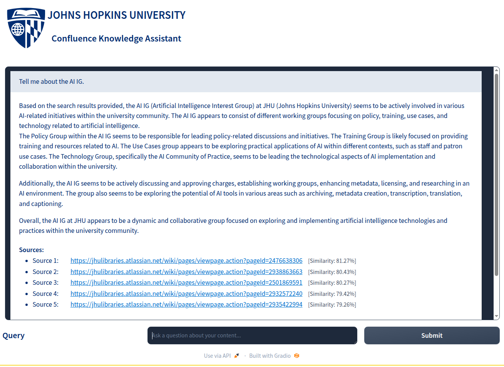
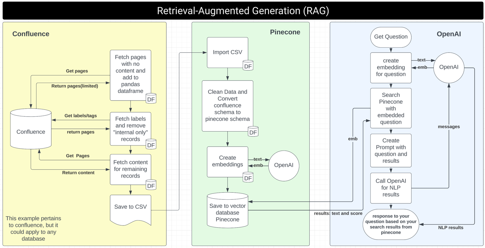

# Retrieval Augmented Generation with Confluence, Pinecone, and OpenAI

This project integrates Confluence, Pinecone, and OpenAI to implement a retrieval augmented generation system. It is designed to run on Python 3.9.6.



## Prerequisites

- Python 3.9.6
- Virtual environment (recommended)
- Visual Studio Code (recommended for environment setup)

## Setup Instructions

### 1. Clone the Repository

Start by cloning this repository to your local machine.


### 2. Create a Python Virtual Environment

It is recommended to run the project within a Python virtual environment to manage dependencies effectively.

- **Using Visual Studio Code**: Click on `View`, then Click on `Command Palette`, search for `Python: Create Environment`, or use the shortcut `Command+Shift+P` and search for the same option.
- **Using Terminal**:

```bash
pipenv install  # This will create a virtual environment and install dependencies
```

### 3. Install Dependencies

After activating the virtual environment, install the required dependencies.

```bash
pipenv install -r requirements.txt
```

### 4. Environment Variables

Create a `.env` file in the root directory of the project to store your API keys and other configurations.

```plaintext
OPENAI_API_KEY=<your_openai_api_key>
PINECONE_API_KEY=<your_pinecone_api_key>
PINECONE_ENVIRONMENT=<your_pinecone_environment>
PINECONE_INDEX_NAME=<your_pinecone_index_name>
CONFLUENCE_DOMAIN=<your_confluence_domain>
USERNAME=<your_username>
PASSWORD=<your_password>
```

## Managing the Vector Database

### Initializing or Updating the Vector Database

Before using the application, you need to populate the Pinecone vector database with your data. Use the `update_database.py` script to import, process, and upload your data to Pinecone:

```bash
pipenv run python update_database.py --csv-file=data/kb.csv
```

### Reset and Recreate the Vector Database

If you need to reset the database and start fresh (e.g., after changing your data or schema):

```bash
pipenv run python update_database.py --reset --csv-file=data/kb.csv
```

The `--reset` flag will delete the existing index before creating a new one and importing data.

### Verify Database Status

To check if your database is properly set up without making any changes:

```bash
pipenv run python update_database.py --verify-only
```

### Troubleshooting Vector Database Issues

If you encounter issues with the Pinecone database, you can run a diagnostic check:

```bash
pipenv run python app_pinecone_openai.py --debug-pinecone
```

This will verify your connection to Pinecone, check the index stats, and run a test query to ensure everything is working properly.

## Running the Applications

### Import Data from Confluence

To import your data from Confluence, run the following command:
Review the main function of the application to understand the flow of the application.

```bash
pipenv run python app_confluence.py
```

### Run Pinecone and OpenAI Application

To execute the Pinecone and OpenAI integration:
Review the main function of the application to understand the flow of the application.

```bash
pipenv run python app_pinecone_openai.py
```

## Additional Resources

- **RAG Flow Chart**: Please refer to the `rag_flowchart.png` in the repository for a visual representation of the system workflow.


## Incremental Updates

This project now supports incremental updates, which means it can update only the content that has changed since the last run, rather than reprocessing all content every time. This makes the update process much more efficient and cost-effective.

To run an incremental update:
```bash
./update_incrementally.sh
```

Or manually:
```bash
# Step 1: Update content from Confluence
pipenv run python app_confluence.py

# Step 2: Perform incremental update
pipenv run python update_database.py --incremental
```

For more details, see [incremental_updates.md](incremental_updates.md).

## Thank you and happy coding!


## Todo
[] Seporate out the data into their own vector database namespaces (SPACES names)
[] Also add all of them to the "default" namespace
[] Add a drop down to isolate to a single name space or all of them.
